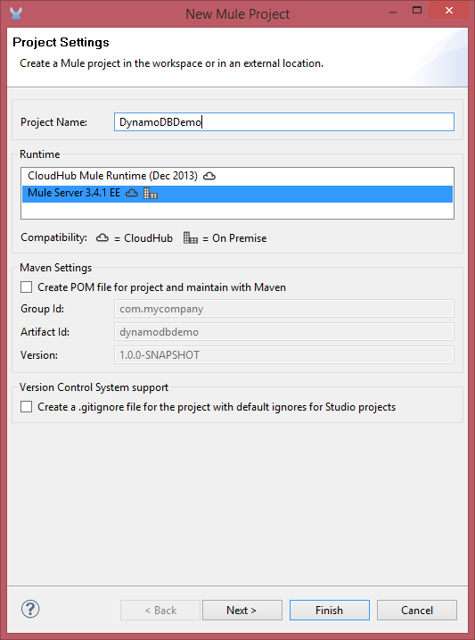
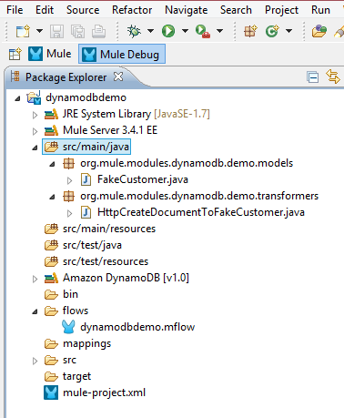
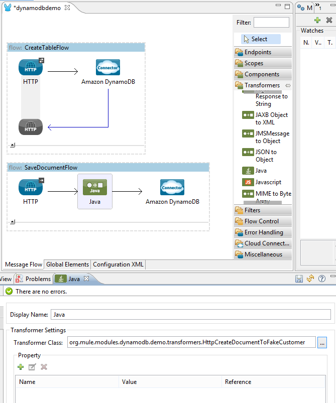
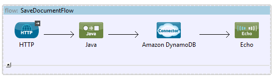
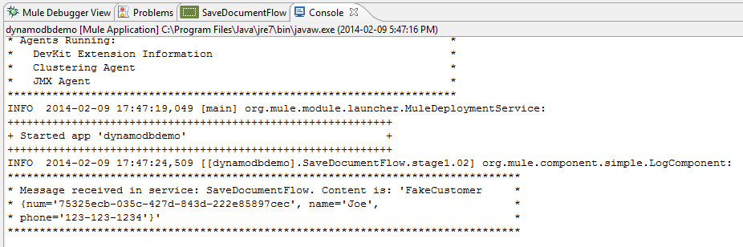
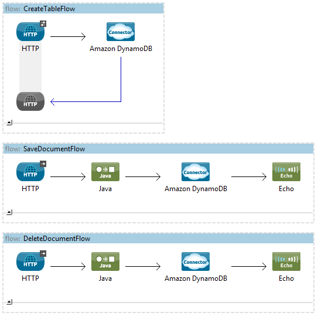
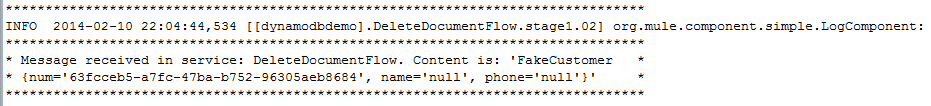

[Purpose](#purpose)

[Prerequisites](#prerequisites)

[Step 1: Install DynamoDB Mule Connector from Update Site](#step1)

[Step 2: Create a Demo Project](#step2)

[Step 3: Create a Table](#step3)

[Step 4: Save a Document](#step4)

[Step 5: Run the Demo project](#step5)

[Step 6: Test the Flows](#step6)

[Flow XML](#flowXML)

[Other Resources](#other)

### Purpose

This document provides detailed instructions on how to acquire the DynamoDB connector and demonstrates how to create a simple demo application that leverages it.

### Prerequisites

In order to build and run this project you'll need:

* an [AWS account](http://aws.amazon.com/)

* [MuleStudio](http://www.mulesoft.org/download-mule-esb-community-edition)

* TBD: NOT NEEDED for this documentation?? - (optional) [Intelli-J IDEA](http://www.jetbrains.com/idea/download/) or [Eclipse](http://www.eclipse.org/downloads/)

The entire Mule Studio project can be found in [GitHub](https://github.com/sporcina/dynamodb-connector/tree/master/dynamodbdemo).  You can download it from there if you don't want to create everything
from scratch.

### Step 1: Install DynamoDB Mule Connector

## From the Update Site (TBD)

*    In Mule Studio select **Help** \> **Install New Software...**.

*    Select **MuleStudio Cloud Connectors Update Site** in **Work With** drop-down.

*    Check two items from Community folder: **Mule DynamoDB Connector Mule Studio Extension** and click **Next**.

*    Follow installation steps.

## From a local build

*    Navigate to your DynamoDB root folder (e.g "~/git_repos/dynamodb-connector" -or- "c:\git_repos\dynamodb-connector")
*    Execute the this command: "mvn clean package -Ddevkit.studio.package.skip=false"
*    In Mule Studio select **Help** \> **Install New Software...**.
*    Select **Add**, then select **Archive**
*    Navigate to the **target** folder under your DynamoDB root folder
*    Select **UpdateSite.zip**, then select **Open**
*    In the **name** field, type in **DynamoDB Cloud Connector**, then select **OK**
*    Select the checkbox next to **Mule Cloud Connectors**
*    Select **Next** until you get the **License Agreement**
*    Accept the **License Agreement** and select **Finish**
*    If you are prompted with a warning that the connector is unsigned, just select **OK**
*    If prompted, restart Mule Studio

### Step 2: Create a Demo Project

*    Run Mule Studio and select **File \> New \> Mule Project** menu item.

*    Type **DynamoDBDemo** as a project name and click **Finish**.

*   Double click on src/main/app/Demo.xml to open it, select Global Elements tab in view (located in the bottom of the next image).

*   Click the Create button
*   In the "Filter" field, type **Amazon** to search for the connector, then under "Cloud Connectors" select **Amazon DynamoDB**.
*   Click OK

*   In the **Global Element Properties** windows, enter your access and secret keys
*   Enter "US_WEST_1" as your region
*   Select **Test Connection...** to confirm that your configuration works before continuing.  If there is a problem, double-check the keys you entered.

Your screen should look like this:

*   Select **OK**
*   Save your project using the **File \> Save All** menu item.

### Step 3: Create a Table

Now we're going to create some Mule work flows that demonstrate some of the DyanamoDB Connector features.  We will use the
HTTP endpoint to invoke our flows, and save some fake customer data to a new DynamoDB table.  If you wish you can use a different endpoint, though they are not covered in this
tutorial.

*   Select the **Message Flow** tab
*   From the Palette tool bar on the right side of the screen, under the "Endpoints" section, drag and drop an **HTTP** endpoint in to the Message Flow canvas
*   Rename the flow from "dynamodbdemoFlow1" to "CreateTableFlow" by right-clicking on the text and selecting **Rename**
*   Select the HTTP endpoint to display its property window at the bottom of the screen
*   In the path field, type in **createTable**

Your screen should should look like this:

*   From the Palette tool bar, under the "Cloud Connectors" section, drag and drop an **Amazon DynamoDB** endpoint in to the flow
*   Select the **Amazon DynamoDB** endpoint and change the following properties:
    *   In the **Config Reference**, select "Amazon_DynamoDB"
    *   Ensure that **Create table** is selected under the Operation field
    *   For the **Table Name**, type "MyTestTable"
    *   Enter '1' for the Read and Write Capacity Units
    *   Type 'num' for the Primary Key Name
    *   Enter '10' for the Wait For value

Your **Amazon DynamoDB** endpoint should look like this:

*   To run your flow:
    *   Select your flow to highlight it
    *   From the **Run** menu, select **Run As** then **Mule Application**
    *   Launch your web browser and navigate to "http://localhost:8081/createTable"
    *   Now go back to Mule Studio and select the **Console** tab at the bottom the screen.

You'll see log entries showing the DynamoDB Connector working.  Creating a new table in DynamoDB takes time.  Watch the
status logs until you see the message that the current state is **ACTIVE**.  It should look like this:

If you login to AWS and view your DynamoDB Management Console website, you'll see the newly created table.

*   Terminate your Mule Application instance in Mule Studio by selecting the button shaped like a "red square" on the right side of the screen in the **Console** tab noted earlier

### Step 4: Save a Document

Now that we have a table, we can save information to it.  For the purpose of this demo, we'll save some fake customer data.

*   Create a new flow by again drag-and-dropping the HTTP endpoint from the Palette tool bar, to the Message Flow canvas, below "CreateTableFlow".
*   Rename it to read **SaveDocumentFlow**
*   Change the "Exchange Pattern" to **one-way**.  Feel free to keep it at "request-response" if you want to return an HTTP response at the end of the flow.  Creating an HTTP response is not covered in this tutorial.
*   Type **saveDocument** in the path field

Your screen will look like this:

*   Again, drag and drop the **Amazon DynamoDB** Cloud Connector from the Palette tool bar, in to the "SaveDocument" flow
*   Set the "Config Reference" in the properties for the DynamoDB Cloud Connector to "Amazon_DynamoDB"
*   Change the Operation to "Save document"
*   In the **Table Name** field, type "MyTestTable".  This is the name of the table we create earlier.

We've got the basics the flow setup, which is very similar to the previous flow we created.  Now we'll add new elements to
the flow which will help us create and observe data to save to the table.

TBD: does it matter if the reader does not have Java installed?

*   Select the following links to download two files: the fake customer data model, and our message transformer
    *   [FakeCustomer.java](https://github.com/sporcina/dynamodb-connector/blob/master/dynamodbdemo/src/main/java/org/mule/modules/dynamodb/demo/models/FakeCustomer.java)
    *   [HttpCreateDocumentToFakeCustomer.java](https://github.com/sporcina/dynamodb-connector/blob/master/dynamodbdemo/src/main/java/org/mule/modules/dynamodb/demo/transformers/HttpCreateDocumentToFakeCustomer.java)
*   Save "FakeCustomer.java" in a new package "org.mule.modules.dynamodb.demo.models"
*   Save "HttpCreateDocumentToFakeCustomer.java" in a new package "org.mule.modules.dynamodb.demo.transformers"

Your Mule Studio package explorer should like this:

*   Drag the **Java** transformer from the Palette tool bar, and drop it between the HTTP and Amazon DynamoDB elements in the "saveDocument" flow
*   Go to the properties for the "Java" transformer and change the "Transformer Class" to **HttpCreateDocumentToFakeCustomer**

*   Now find the **Echo** component in the Palette tool bar and place it after the "Amazon DynamoDB" component.  This will display in the console tab what DynamoDB returns after storing the document

*   To run your flow:
    *   Select the "SaveDocumentFlow" to highlight it
    *   From the **Run** menu, select **Run As** then **Mule Application**
    *   Launch your web browser and navigate to "http://localhost:8081/saveDocument?name=Joe&phone=123-123-1234"
    *   Now go back to Mule Studio and select the **Console** tab.

The log shows an entry for FakeCustomer that includes the data we passed to it through the HTTP query parameters.  You'll
note that 'num' is assigned a unique identifier.  This unique identifier is generated by DynamoDB when a document is saved.
This tells you that the document was saved successfully in "MyTestTable".  You could update HttpCreateDocumentToFakeCustomer.java
to add your own unique id to the FakeCustomer, but its is generally not advised.  You have to ensure that the id you create
is unique across all documents in the table.  If not you'll overwrite the existing document that ahs the same id.  Unless
you have a compelling reason too, let DynamoDB assign the document id's for you.

*   Copy the unique value for 'num' and set it aside.  We'll need this value in later in this tutorial.
*   Terminate your Mule Application instance in Mule Studio **Console** tab and save your project.

### Step 5: Delete a Document

Now that we have a document saved in the table, we can remove it using a similar flow.

*   Create a new flow that is identical to the previous flow you created, with the following changes:
    *   Give the HTTP endpoint a path titled "deleteDocument".
    *   Name the flow "DeleteDocumentFlow"
    *   Change the Amazon DynamoDB Cloud Connector element to use "Delete document" operation
    *   The Java transformer should reference "HttpDeleteDocumentToFakeCustomer.java", which can be downloaded [here](https://github.com/sporcina/dynamodb-connector/blob/master/dynamodbdemo/src/main/java/org/mule/modules/dynamodb/demo/transformers/HttpDeleteDocumentToFakeCustomer.java).

Your flow tab should look like this:

*   Go to your web browser and navigate to **http://localhost:8081/deleteDocument?num={insert the unique id you copied previously}**.  (e.g. "http://localhost:8081/deleteDocument?num=63fcceb5-a7fc-47ba-b752-96305aeb8684")

Your Console tab in Mule Studio should show the response from DynamoDB; a FakeCustomer whose unique id matches the id
you sent to the service.  Only the unique id is sent back in the 'num' field.  No other data is returned.

### Step 6: Run the Demo project

### Step 7: Test the Flows

[Flow XML](#flowXML)

[Other Resources](#other)